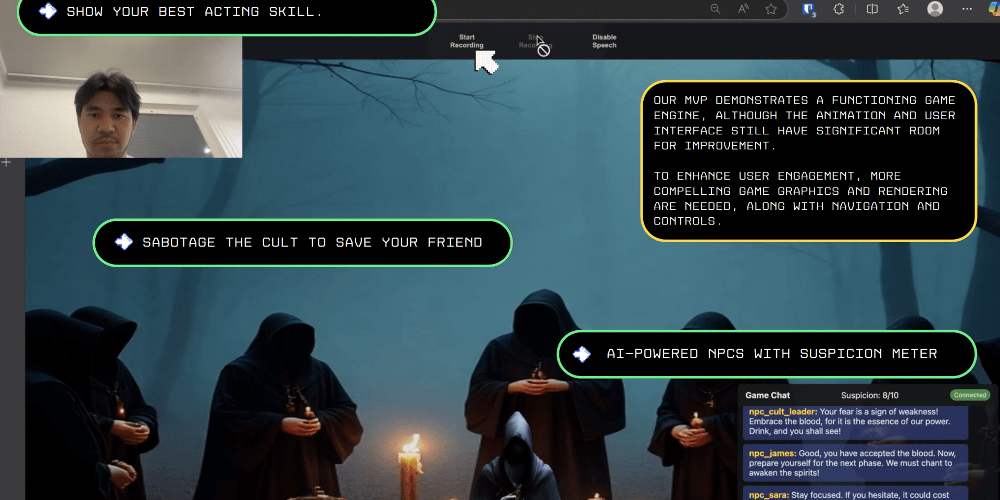
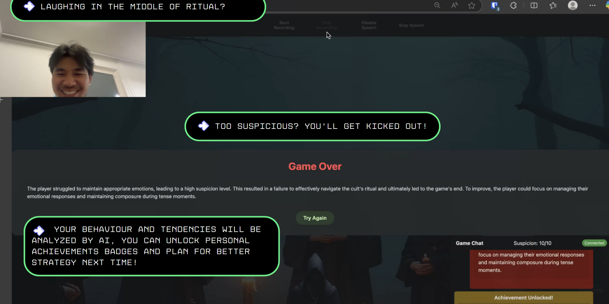

# Emotion-Driven Interactive Game

A browser-based game where your emotional state and verbal responses determine the outcome of a tense confrontation.

## Overview

This project is an interactive web game that uses emotion detection and speech recognition to create a unique, personalized experience. In the game, you encounter a thug who wants to steal your purse. Your goal is to convince them not to do so by maintaining confidence and using appropriate verbal responses.

[Try it live here!](https://supercell-hackathon.vercel.app/)

[Watch the demo video](https://youtu.be/LzBpoknIJgM)

## Features

- **Emotion Detection**: Uses your webcam to analyze facial expressions and detect your emotional state
- **Speech Recognition**: Captures your verbal responses to influence game progression
- **AI-Powered Interactions**: Integrates with LLM to dynamically adjust the scenario based on your reactions
- **Immersive Experience**: Combines visual, audio, and interactive elements for an engaging game

## Project Structure

```
.
├── backend/               # Python backend services
│   ├── app.py             # Main FastAPI application
│   ├── emotion_detector/  # Emotion detection module
│   ├── game_engine/       # Game state and logic
│   ├── llm_integration/   # LLM API integration
│   └── requirements.txt   # Python dependencies
├── frontend/              # Web frontend
├── video2text/            # Video processing utilities
└── README.md              # Project documentation
```

## Setup Instructions

### Prerequisites

- Python 3.8+
- Node.js 14+ (for development)
- Web browser with camera and microphone access

### Backend Setup

1. Clone the repository:

   ```
   git clone <repository-url>
   cd <repository-name>
   ```

2. Create a virtual environment:

   ```
   cd backend
   python -m venv venv
   source venv/bin/activate  # On Windows: venv\Scripts\activate
   ```

3. Install dependencies:

   ```
   pip install -r requirements.txt
   ```

4. Set up environment variables:

   ```
   # Create a .env file with:
   OPENAI_API_KEY=your_api_key_here
   ```

5. Start the backend server:
   ```
   uvicorn app:app --reload
   ```

### Frontend Setup

1. Open a new terminal window
2. Navigate to the frontend directory:

   ```
   cd frontend
   ```

3. Install dependencies (if applicable):

   ```
   npm install
   ```

4. Start the development server:

   ```
   # Using Python:
   python -m http.server
   # Or using Node.js:
   npm run dev
   # Or with a simple server:
   npx serve
   ```

5. Open your browser and navigate to:
   ```
   http://localhost:8000  # Python http.server
   # or
   http://localhost:3000  # Node.js server (port may vary)
   ```

## Usage

1. Grant camera and microphone permissions when prompted
2. The game will start automatically
3. Try to remain calm and confident while responding to the thug's demands
4. Your emotional state and verbal responses will influence the outcome
5. **For best results**: Don't be shy with your facial expressions! The emotion detection works better with more pronounced expressions, so feel free to exaggerate your emotions to see a stronger impact on gameplay.

## Screenshots






## Development

For detailed implementation information, refer to the documentation in each module.

## Deployed Version

The live version of this project is available at:
[https://supercell-hackathon.vercel.app/](https://supercell-hackathon.vercel.app/)

## License

MIT
